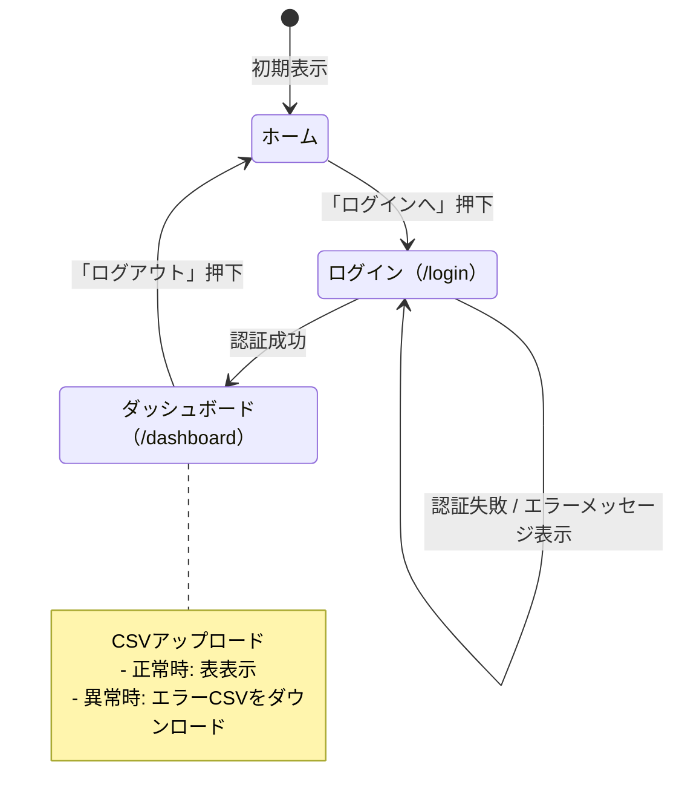
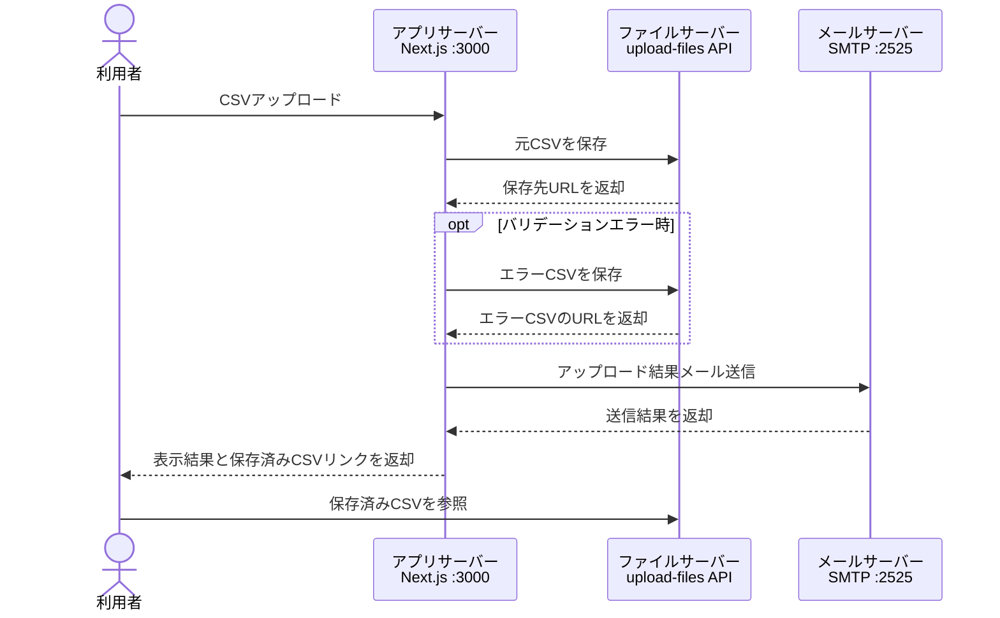

# Playwright Sample App

[`Next.js`](./next.config.ts) と [`Playwright`](./playwright.config.ts) で最小構成のアプリとE2Eテストを用意したサンプルです。

## セットアップ

1. 依存関係をインストールします。

   ```bash
   npm install
   ```

2. Playwrightのブラウザをインストールします。

   ```bash
   npx playwright install
   ```

## プロジェクト構成

```text
.
├── README.md                         # プロジェクト全体の説明
├── package.json                      # スクリプトと依存関係の定義
├── playwright.config.ts              # Playwright の設定
├── scripts/
│   └── mail-server.js                # ローカルSMTPサーバーとヘルスチェックサーバー
├── data/
│   ├── data.csv                      # サンプル用の正常CSV
│   └── error-data.csv                # サンプル用の異常CSV
├── scenario/
│   ├── scenario.md                   # 画面×シナリオの管理表
│   ├── navigation.spec.ts            # 画面表示と基本遷移のE2Eテスト
│   ├── auth.spec.ts                  # ログイン・ログアウトのE2Eテスト
│   ├── csv-upload.spec.ts            # CSVアップロードとメール確認のE2Eテスト
│   ├── fixtures/
│   │   ├── data.csv                  # シナリオ実行で使う正常CSV
│   │   └── error-data.csv            # シナリオ実行で使う異常CSV
│   └── helpers/
│       ├── auth-helper.ts            # ログイン操作の共通ヘルパー
│       ├── csv-validate-helper.ts    # CSVアップロードとメール確認の共通ヘルパー
│       └── screenshot-helper.ts      # スクリーンショット保存の共通ヘルパー
└── src/
    ├── app/
    │   ├── layout.tsx                # 共通レイアウト
    │   ├── page.tsx                  # ホーム画面
    │   ├── globals.css               # 全体スタイル
    │   ├── login/
    │   │   └── page.tsx              # ログイン画面
    │   ├── dashboard/
    │   │   └── page.tsx              # ダッシュボード画面とCSV処理
    │   └── api/
    │       ├── test-mails/
    │       │   └── route.ts          # 保存済みテストメールの取得・削除API
    │       └── upload-notify/
    │           └── route.ts          # アップロード結果メール送信API
    ├── components/
    │   └── LoginForm.tsx             # ログインフォーム部品
    ├── lib/
    │   ├── auth.ts                   # 固定認証ロジック
    │   ├── mail.ts                   # アップロード結果メール送信処理
    │   └── mailbox.ts                # テストメール保存領域の操作
    └── types/
        └── css.d.ts                  # CSS Modules 用の型定義
```

## 画面遷移図

[`HomePage`](src/app/page.tsx:5)、[`LoginPage`](src/app/login/page.tsx:3)、[`LoginForm`](src/components/LoginForm.tsx:7)、[`DashboardPage`](src/app/dashboard/page.tsx:222) の遷移は次のとおりです。



## システム構成

CSVアップロード時のアプリサーバー、ファイルサーバー、メールサーバーの連携は次のとおりです。



## 画面×機能マトリクス

主要な画面と機能の対応は次のとおりです。
（単体試験の漏れを防ぐためのマトリクス）

| 機能                       | ホーム | ログイン | ダッシュボード |
| -------------------------- | ------ | -------- | -------------- |
| 画面表示                   | ◯      | ◯        | ◯              |
| ログイン画面への遷移       | ◯      |          |                |
| メールアドレス入力         |        | ◯        |                |
| パスワード入力             |        | ◯        |                |
| ログイン成功               |        | ◯        |                |
| ログイン失敗時のエラー表示 |        | ◯        |                |
| ログイン後のユーザー表示   |        |          | ◯              |
| CSVアップロード            |        |          | ◯              |
| CSV内容の表表示            |        |          | ◯              |
| バリデーションエラー表示   |        |          | ◯              |
| エラーCSVダウンロード      |        |          | ◯              |
| ログアウト                 |        |          | ◯              |

## サーバー起動

### 開発サーバー

```bash
npm run dev
```

ブラウザで [`http://127.0.0.1:3000`](http://127.0.0.1:3000) を開くと、[`/`](./src/app/page.tsx) → [`/login`](./src/app/login/page.tsx) → [`/dashboard`](./src/app/dashboard/page.tsx) の遷移を確認できます。

### メールサーバー

メール送信確認用のローカルSMTPサーバーは [`scripts/mail-server.js`](./scripts/mail-server.js) で起動できます。

```bash
npm run mail:server
```

既定では SMTP を `127.0.0.1:2525`、ヘルスチェック用 HTTP サーバーを `127.0.0.1:4025` で待ち受けます。

メールは、[`http://localhost:3000/api/test-mails`](http://localhost:3000/api/test-mails) で確認できます。

## Scenarioテスト実行

```bash
npm run test:scenario
```

主なテスト対象は次のとおりです。

- [`scenario/navigation.spec.ts`](./scenario/navigation.spec.ts): ホーム表示と画面遷移
- [`scenario/auth.spec.ts`](./scenario/auth.spec.ts): 正常ログイン・異常ログイン・ログアウト
- [`scenario/helpers/auth-helper.ts`](./scenario/helpers/auth-helper.ts): ログイン操作の共通化

## 認証情報

- メールアドレス: `test@example.com`
- パスワード: `password123`
# playwright
