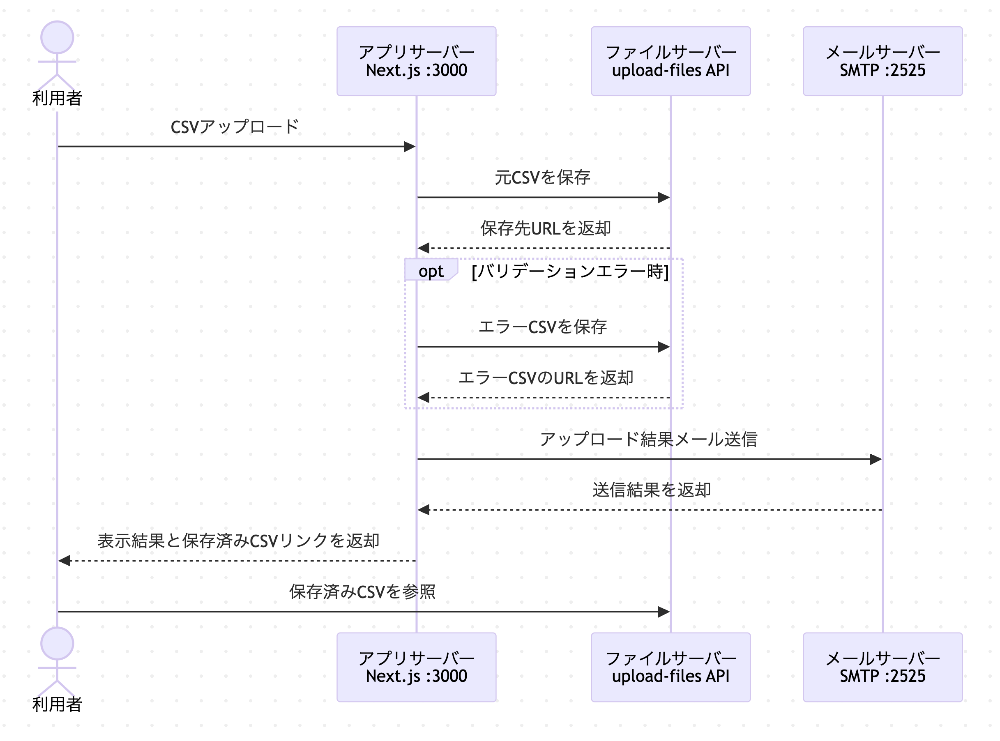
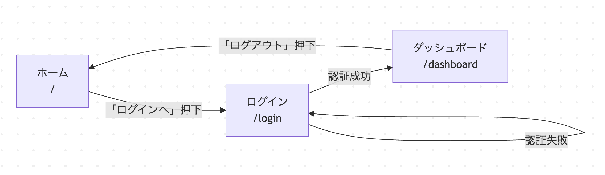

# Playwright Sample App 入門

簡易な Web アプリを作り、[`Playwright`](../playwright.config.ts) で E2E テストを動かす流れを
初めての人向けに理解するためのスライドです。

- アプリ: [`Next.js`](../next.config.mjs)
- テスト: [`scenario/*.spec.ts`](../scenario)
- 画面: [`src/app`](../src/app)

## このプロジェクトで分かること

1. 簡易な Web アプリを用意する流れ
2. 画面操作を E2E テストで確認する方法
3. 入力エラーや CSV アップロードもテストできること
4. メール送信結果まで含めて検証できること

## 作ったアプリの概要

このサンプルには 3 つの画面があります。

- ホーム画面: [`src/app/page.tsx`](../src/app/page.tsx)
- ログイン画面: [`src/app/login/page.tsx`](../src/app/login/page.tsx)
- ダッシュボード画面: [`src/app/dashboard/page.tsx`](../src/app/dashboard/page.tsx)

ダッシュボードでは CSV をアップロードして、

- 正常なら表を表示
- 異常ならエラー CSV をダウンロード
- 結果をメール通知

という流れを確認できます。

## システム構成



## 画面遷移



- ログイン画面では成功時と失敗時で遷移先が変わります
- ダッシュボードでは CSV アップロード機能を使えます

## ディレクトリ構成の見方

主に見る場所は次の 4 つです。

| 役割           | 場所                                  |
| -------------- | ------------------------------------- |
| アプリ画面     | [`src/app`](../src/app)               |
| 共通部品       | [`src/components`](../src/components) |
| 業務ロジック   | [`src/lib`](../src/lib)               |
| シナリオテスト | [`scenario`](../scenario)             |

## 主要ファイル

| ファイル                                                          | 役割                         |
| ----------------------------------------------------------------- | ---------------------------- |
| [`src/app/page.tsx`](../src/app/page.tsx)                         | ホーム画面                   |
| [`src/app/login/page.tsx`](../src/app/login/page.tsx)             | ログイン画面                 |
| [`src/components/LoginForm.tsx`](../src/components/LoginForm.tsx) | ログイン入力フォーム         |
| [`src/app/dashboard/page.tsx`](../src/app/dashboard/page.tsx)     | CSV アップロードと結果表示   |
| [`src/lib/auth.ts`](../src/lib/auth.ts)                           | 認証ロジック                 |
| [`src/lib/mail.ts`](../src/lib/mail.ts)                           | メール送信処理               |
| [`src/lib/mailbox.ts`](../src/lib/mailbox.ts)                     | テスト用メール保存領域の操作 |

## Playwright テストの置き場所

シナリオテストは [`scenario`](../scenario) にあります。

- [`scenario/navigation.spec.ts`](../scenario/navigation.spec.ts)
  - 画面表示、基本遷移
- [`scenario/auth.spec.ts`](../scenario/auth.spec.ts)
  - 正常ログイン、異常ログイン、ログアウト
- [`scenario/csv-upload.spec.ts`](../scenario/csv-upload.spec.ts)
  - CSV アップロード、エラー CSV、メール確認

## テストコードの基本形

Playwright のテストは、

1. 画面を開く
2. 入力する
3. ボタンを押す
4. 結果を確認する

という流れで書きます。

たとえば `test()`や`expect()`を使って、
見出しや URL が期待どおりかを検証しています。

<!-- _class: small-table -->

## シナリオのマトリクス

| シナリオ                                  | ホーム | ログイン | ダッシュボード |
| ----------------------------------------- | ------ | -------- | -------------- |
| ホーム表示とログイン画面への遷移          | ◯      | ◯        |                |
| 正常ログイン                              |        | ◯        | ◯              |
| 異常ログイン                              |        | ◯        |                |
| ログアウトでホームへ戻る                  | ◯      |          | ◯              |
| 正常なCSVアップロード                     |        |          | ◯              |
| 不正なCSVアップロードとエラーファイル出力 |        |          | ◯              |

## テストシナリオ① 正常ログインの例

[`scenario/auth.spec.ts`](../scenario/auth.spec.ts) では、
正常ログイン時に次を確認しています。

- メールアドレス入力
- パスワード入力
- ログインボタン押下
- ダッシュボードへ遷移
- ユーザー名表示

これにより「入力成功後に次画面へ進める」ことを保証できます。

## テストシナリオ② 異常ログインの例

同じく [`scenario/auth.spec.ts`](../scenario/auth.spec.ts) では、
異常系として次を確認しています。

- 不正な資格情報を入力
- ログイン画面に残る
- エラーメッセージが表示される

正常系と異常系を両方持つことで、
「成功すること」だけでなく「失敗時に壊れないこと」も確認できます。

## テストシナリオ③ CSV アップロードの正常系

[`scenario/csv-upload.spec.ts`](../scenario/csv-upload.spec.ts:16) では、
正常 CSV のアップロード後に次を確認しています。

- ファイル名表示
- 表のヘッダー表示
- データ行表示
- エラーメッセージが出ていないこと
- 成功メールが保存されていること

使用資材:

- [`scenario/fixtures/data.csv`](../scenario/fixtures/data.csv)

## テストシナリオ④ CSV アップロードの異常系

[`scenario/csv-upload.spec.ts`](../scenario/csv-upload.spec.ts:44) では、
異常 CSV のアップロード後に次を確認しています。

- バリデーションエラー表示
- 表が表示されないこと
- エラー CSV がダウンロードされること
- 失敗メールが保存されていること

使用資材:

- [`scenario/fixtures/error-data.csv`](../scenario/fixtures/error-data.csv)

## メール確認

このプロジェクトでは、
画面だけではなくメール通知処理も確認しています。

- メール送信: [`src/lib/mail.ts`](../src/lib/mail.ts)
- 保存済みメール取得 API: [`src/app/api/test-mails/route.ts`](../src/app/api/test-mails/route.ts)
- ローカル SMTP サーバー: [`scripts/mail-server.js`](../scripts/mail-server.js)

## メールがテスト間で混ざらない理由

[`scenario/csv-upload.spec.ts`](../scenario/csv-upload.spec.ts:12) の [`test.beforeEach()`](../scenario/csv-upload.spec.ts:12) で、
各テストの前にメールボックスを初期化しています。

流れ:

- [`clearMailbox()`](../scenario/helpers/csv-validate-helper.ts:52)
- [`DELETE()`](../src/app/api/test-mails/route.ts:14)
- [`clearStoredMails()`](../src/lib/mailbox.ts:42)

これにより、前のテストのメールが次のテストに残りません。

## 共通ヘルパーを使う理由

テストコードでは、同じ処理を何度も書かないように
ヘルパーを分けています。

- [`loginAsValidUser()`](../scenario/helpers/auth-helper.ts)
- [`uploadCsv()`](../scenario/helpers/csv-validate-helper.ts:25)
- [`uploadCsvAndCaptureDownload()`](../scenario/helpers/csv-validate-helper.ts:30)
- [`createScreenshotTaker()`](../scenario/helpers/screenshot-helper.ts)

これにより、テスト本文が読みやすくなります。

## 実行手順

1. 依存関係をインストール
2. Playwright ブラウザをインストール
3. 必要ならメールサーバーを起動
4. 開発サーバーを起動
5. シナリオテストを実行

コマンド:

```bash
npm install
npx playwright install
npm run mail:server
npm run dev
npm run test:scenario
```

## まとめ

- Playwright で画面遷移、ファイルアップロード、ダウンロード、メール処理を自動でチェックできる。
- シナリオマトリクスを作ることで、テストの漏れに気づきやすくなる。
- 新しいテストを作る際に、類似のシナリオを見つけやすくなる。[1]

### 参考文献

[1]『SHIFT流 AI時代のソフトウエアテスト』株式会社SHIFT（日経ＢＰ）
